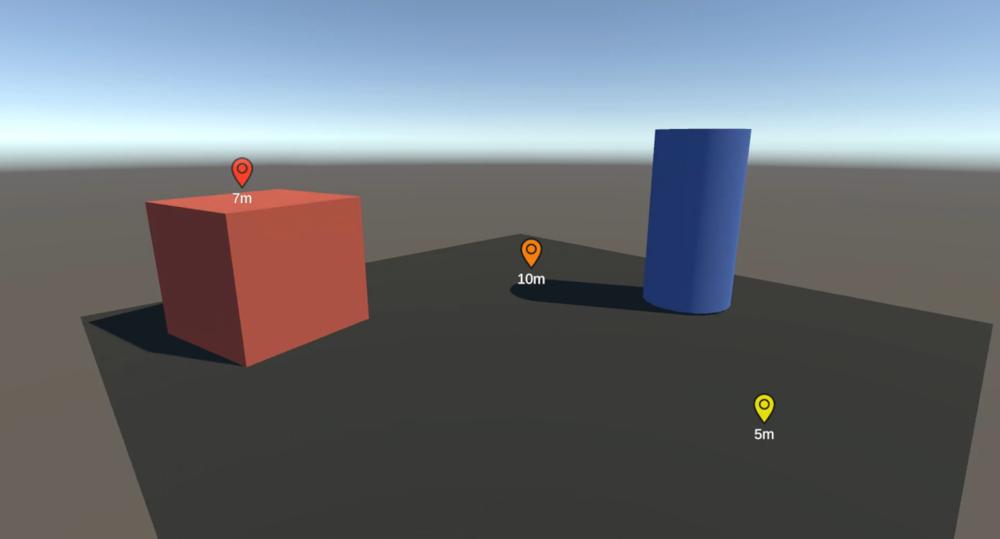

# Simple Waypoint System for Unity

A lightweight and user-friendly Waypoint System for Unity, built using uGUI (Unity UI) and TextMeshPro for enhanced text rendering.

## Features

- **Easy Integration:** Quickly integrate the system by just dragging the WaypointCanvas prefab in your scene.
- **uGUI and TextMeshPro:** Utilizes Unity's GUI system for UI elements and TextMeshPro for improved text rendering.
- **Viewport Clamping:** Keep waypoints within the screen bounds for consistent positioning.
- **Visibility Control:** Easily toggle waypoint canvas visibility
- **Add and Remove waypoints:** Easily add and remove waypoints

## Usage

1. Import the `WaypointSystem` folder in your `Assets` folder
2. Go in `WaypointSystem > Prefabs` and drag the `WaypointCanvas` prefab in your scene
3. Assign your camera to the `Camera` field on the `WaypointManager` component of the `WaypointCanvas` gameobject
4. Call methods such as `AddWaypoint` or `RemoveWaypoint` to add or remove waypoints

## Example

### Add a waypoint 

```csharp
Vector3 position = new Vector3(2f, 5.2f, 7.1f);
WaypointData waypoint = AddWaypoint(position, "myFirstWaypoint");
/* handle the waypoint */
```

### Remove a waypoint

```csharp
Vector3 position = new Vector3(2f, 5.2f, 7.1f);
WaypointData waypoint = AddWaypoint(position, "myFirstWaypoint");

// By object
if(RemoveWaypoint(waypoint))
{
    // Waypoint found in the list
} else {
    // Waypoint not found in the list
}

/* or */

// By ID
if(RemoveWaypoint("myFirstWaypoint"))
{
    // Waypoint found in the list
} else {
    // Waypoint not found in the list
}
```
## Dependencies
- Unity UI (uGUI)
- TextMeshPro
